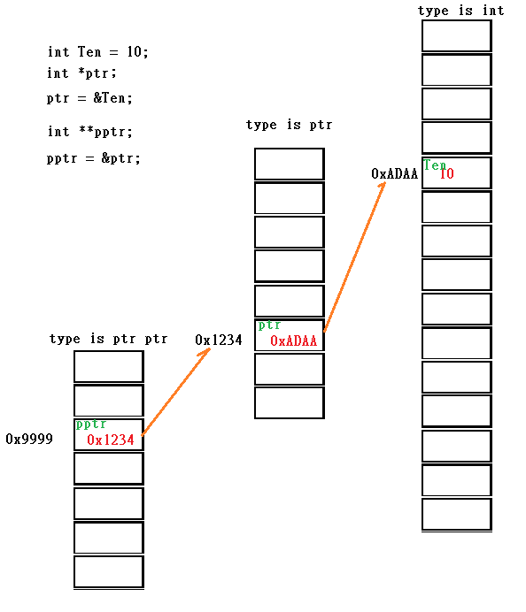

# C_Note

fun_p_a.c          
: Example of function pointer array using MACRO to define. 

mutex_wait.c       
: Example of using mutex to protect critical section between two pthread.

sem_wait.c         
: Example of using semaphore to protect critical section between two pthread.  

sem_wait_process.c         
: Example of using semaphore to protect critical section between two Process.   

Seldom use mutex to protect C.S between process.

* create expand macro source
gcc -std=gnu++11 -E me_c.cpp  -o me_c.i -I../include -I../open_source/json-cxx/include -I../open_source/jsoncpp-1.7.2.no-abi/include

* pointer to poinetr
 

* array concept
https://blog.danielchen.cc/2020/05/30/C-Array-Function-Parameter/?fbclid=IwAR14ouFITGf4lA4rmKlBi5RvMDwCvmdauyiyHS_PlbNcvyQ9c-VQ3BJsg4w
